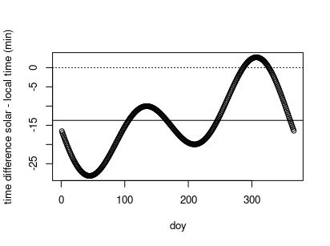
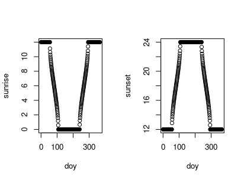
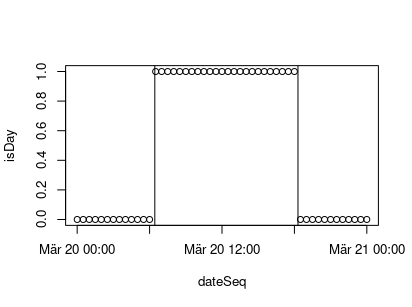

<!--
rmarkdown::render("vignettes/overview.Rmd", output_format = "md_document")
-->

## Overview

The `solartime` package provides utilities to work with solar time,
i.e. where noon is exactly when sun culminates. It provides functions to
compute

-   difference between local time zone and solar time
-   sun position
-   sunrise, sunset, daylength, and daytime flags

## Usage

    require(solartime)

### Difference between solar time and local time

The city of Jena is located west of the timezone’s meridian. Hence, the
sun culminates around 13 minutes later.

    latDeg <- 50.93; longDeg <- 11.57
    (localDiff <- computeSolarToLocalTimeDifference(longDeg, 1L)*60)

    ## [1] -13.72

The time difference shifts during the year because of [earth orbit’s
eccentricity](https://en.wikipedia.org/wiki/Orbital_eccentricity).

    doy <- 1:366
    locaDiffDoi <- computeSolarToLocalTimeDifference(longDeg, 1L, doy)*60
    plot(locaDiffDoi  ~ doy, ylab = "time difference solar - local time (min)")
    abline(h = localDiff); abline(h = 0, lty = "dotted")

During most days, the sun culminates after noon, but during a few days
in autumn the sun culminates earlier than noon of the local time zone.

### Computing sun position

Using function `computeSunPosition`.

    times <- seq( 
      ISOdate(2018, 11, 21, 0, tz = "Etc/GMT-1"), by = "2 hour", length.out = 13)
    ans <- computeSunPosition(times, latDeg = latDeg, longDeg = longDeg)
    cbind(data.frame(timestamp = times), as.data.frame(ans))

    ##              timestamp         hour declination   elevation     azimuth
    ## 1  2018-11-21 00:00:00  0.007677319  -0.3428584 -1.02475619 0.003645122
    ## 2  2018-11-21 02:00:00  2.007677319  -0.3428584 -0.88587017 0.843474263
    ## 3  2018-11-21 04:00:00  4.007677319  -0.3428584 -0.59048251 1.386239933
    ## 4  2018-11-21 06:00:00  6.007677319  -0.3428584 -0.26282498 1.793575561
    ## 5  2018-11-21 08:00:00  8.007677319  -0.3428584  0.03683142 2.188474356
    ## 6  2018-11-21 10:00:00 10.007677319  -0.3428584  0.25645552 2.635087174
    ## 7  2018-11-21 12:00:00 12.007677319  -0.3428584  0.33904050 3.143599850
    ## 8  2018-11-21 14:00:00 14.007677319  -0.3428584  0.25522232 3.651797949
    ## 9  2018-11-21 16:00:00 16.007677319  -0.3428584  0.03476366 4.097884290
    ## 10 2018-11-21 18:00:00 18.007677319  -0.3428584 -0.26529678 4.492580298
    ## 11 2018-11-21 20:00:00 20.007677319  -0.3428584 -0.59297225 4.900381623
    ## 12 2018-11-21 22:00:00 22.007677319  -0.3428584 -0.88775827 5.444904168
    ## 13 2018-11-22 00:00:00  0.003498418  -0.3467846 -1.02868424 0.001669479

The return value is a data.frame with polar coordinates of the sun in
radian on the [horizontal
coordinatesystem](https://en.wikipedia.org/wiki/Horizontal_coordinate_system):

-   elevation: angle above the horizon,
-   azimuth: angle around the horizon, measured from true north
    increasing eastward, and
-   [declination](https://en.wikipedia.org/wiki/Declination): angle
    between celestial equator and the observers, fundamental plane,
    i.e. the plane that contains the horizon
-   fractional hour after midnight

In the example the azimuth increases from slightly more than zero at
midnight to 2*π* at the following midnight. Elevation increases from
negative values to 0 at sunset, maximum at noon declining to zero at
sunset. Declination in early winter decreases to more negative values
until it reaches the negative of the earth axial tilt on December
solstice.

### Sunrise and sunset

Sunrise and sunset are computed in fractional hours after midnight.
Neglecting the difference between solar time and local time introduces a
bias. Daylength is not biased by neglecting solar time correction.

    today <- as.POSIXlt(ISOdate(2018,3,1,0, tz = "Etc/GMT-1"))
    (sunrise <- computeSunriseHour(today, latDeg = latDeg
                                   , isCorrectSolartime = FALSE))

    ## [1] 6.685696

    (sunrise <- computeSunriseHour(today, latDeg = latDeg, longDeg = 11.586))

    ## [1] 7.129989

    (sunset <- computeSunsetHour(today, latDeg = latDeg, longDeg = 11.586))

    ## [1] 17.7586

    (daylength <- computeDayLength(today, latDeg = latDeg))

    ## [1] 10.62861

Sunrise is set to 12 for polar nights and 0 for polar days. Similarly,
sunset is set to 12 for polar nights and to 0 for polar days.

    doy <- 1:366
    sunrise <- computeSunriseHourDoy( doy, latDeg = +80, isCorrectSolartime = FALSE)
    sunset <- computeSunsetHourDoy( doy, latDeg = +80, isCorrectSolartime = FALSE)
    par(mfrow = c(1,2)); plot(sunrise ~ doy ); plot(sunset ~ doy )

### Further Utilities

Functions `computeIsDayByHour` and `computeIsDayByLocation` quickly
classify daytime and nighttime records of a dataset.

    dateSeq <- seq( 
      as.POSIXct("2017-03-20", tz = "Etc/GMT-1")
      , as.POSIXct("2017-03-21", tz = "Etc/GMT-1")
      , by = "30 min")
    isDay <- computeIsDayByLocation(dateSeq, latDeg = 50.93, longDeg = 11.59)

Function `getHoursAheadOfUTC` provides the integer timeZone argument of
a timestamp, required other functions of the package. Similarly,
`getFractionalHours` provides fractional hours after midnight of a
timestamp.

    #around daylight saving time step in Central European time
    t1 <- as.POSIXct("2018-10-28 01:30", tz = "Europe/Berlin")
    dateSeq <- seq(t1, by = "30 min", length.out = 6)
    hoursAheadOfUTC <- getHoursAheadOfUTC(dateSeq)
    fracHours <- getFractionalHours(dateSeq)
    data.frame(dateSeq, hoursAheadOfUTC, fracHours)

    ##               dateSeq hoursAheadOfUTC fracHours
    ## 1 2018-10-28 01:30:00               2       1.5
    ## 2 2018-10-28 02:00:00               2       2.0
    ## 3 2018-10-28 02:30:00               2       2.5
    ## 4 2018-10-28 02:00:00               1       3.0
    ## 5 2018-10-28 02:30:00               1       3.5
    ## 6 2018-10-28 03:00:00               1       4.0

<!-- 
See the [package vignettes](https://github.com/bgctw/solartime/tree/master/vignettes) (*.md) for further examples.
-->
